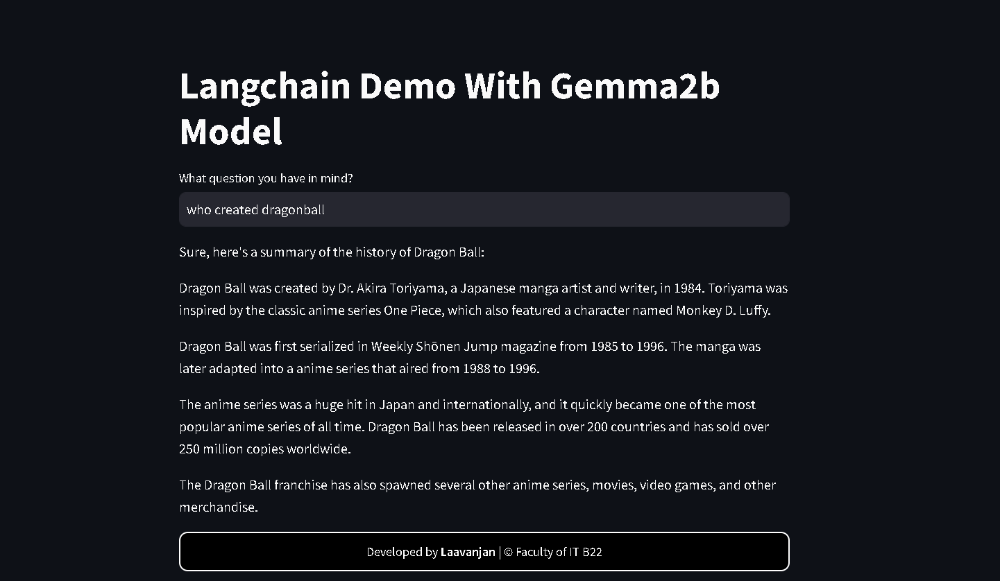
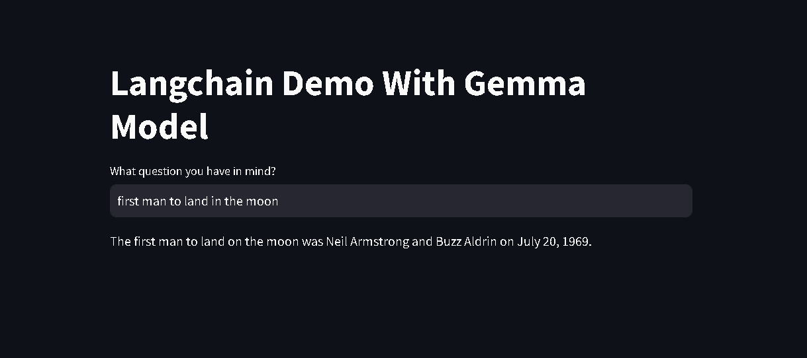
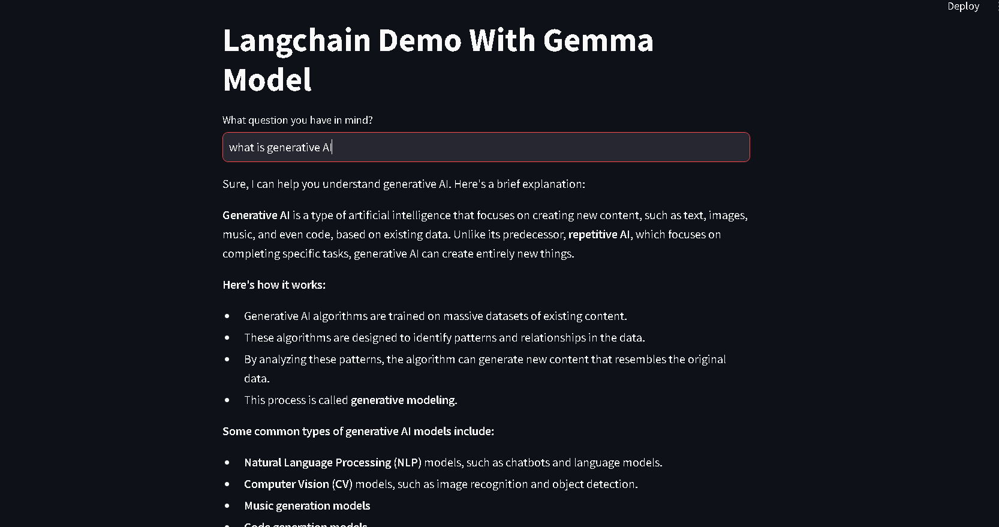

# Langchain Chatbot with Gemma 2B

## Overview

This is a **Streamlit-based chatbot** powered by **LangChain** and **Gemma 2B** using the **Ollama framework**. The chatbot is designed to provide intelligent responses based on user queries, leveraging **LangChain's** prompting capabilities and **LLM inference**.
  
  
  
_(Planned: Include relevant project images here)_
## Features

- Uses **Gemma 2B** model for natural language understanding.
- Built with **Streamlit** for an interactive web interface.
- Uses **LangChain** for structured prompt handling and model execution.
- Supports **environment variable-based configurations**.
- Simple and lightweight deployment.

## Technologies Used

- **Python 3.9+** - Programming language.
- **Streamlit** - Web framework for building interactive applications.
- **LangChain** - Framework for LLM-based applications.
- **Ollama** - Model hosting for  Gemma.
- **FAISS/ChromaDB** (Optional) - Vector database for efficient retrieval.
- **dotenv** - Managing environment variables securely.
- **Jupyter Notebook** - Interactive computing environment for development and testing.

## Installation

### Prerequisites

Ensure you have **Python 3.9+** installed on your system.

### Clone the Repository

```sh
git clone https://github.com/laavanjan/Langchain-chatbot-with-gemma-2b-Model
```

### Install Dependencies

```sh
pip install -r requirements.txt
```

### Set Up Environment Variables

Create a `.env` file in the project root and define the following to track to LLM:

```ini
LANGCHAIN_API_KEY=your_api_key
LANGCHAIN_PROJECT=your_project_name
```

## Running the Chatbot

Launch the Streamlit app:

```sh
streamlit run app.py
```

The application will open in your browser, allowing you to interact with the chatbot.

## Installing the Gemma:2B Model for Ollama

To use **Gemma 2B**, you need to install the model in **Ollama**. Follow these steps:

1. Pull the **Gemma 2B** model using Ollama:
   ```sh
   ollama pull gemma:2b
   ```

## Credits

- Developed by **Laavanjan** | Faculty of IT B22.
- Built with **LangChain, Streamlit, and Ollama**.

## License

📜 This project is open-source and available under the GPL License. 🛠️✨


